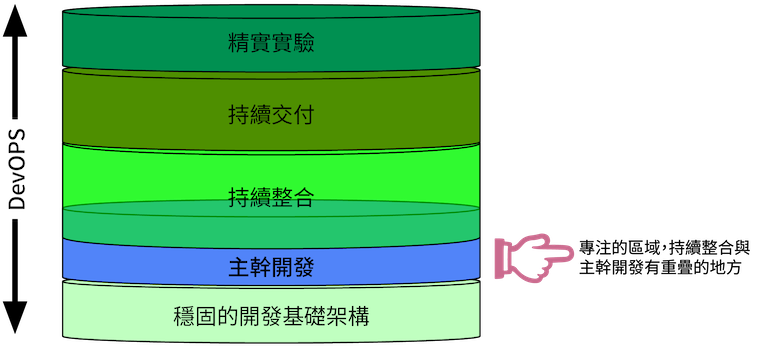

<!--
A development team wanting to go ahead with Trunk-Based Development have prerequisite achievements. Once the team has 
done a few commits in the correct style, other things are now facilitated. We can show this as a layer cake:

DevOps is encompassing too. At the very least, the expansion of development best practices into operations heartlands.
-->

想採用主幹開發的開發團隊，需要具備一些先決條件。一旦團隊按照正確的風格進行了幾次提交，其他事情就會更容易進行。我們可以將這種情況用一個分層結構圖表示：

DevOps 也是一個包容性的概念。至少，它將開發最佳實踐擴展到運營領域的核心地帶。

<!--
## Trunk-Based Development prerequisites

(layers below it)

### Solid Development Infrastructure

Installation of your VCS technology is part of a foundational development infrastructure that includes developer 
workstations or laptops that are appropriate for build testing and running of the application or service being made.
Developers running the application only need it to be functionally viable. It doesn't have to match the performance
of the expected production environment, and it is OK for it to be non-functionally different in other ways too.

In the modern DevOps era, this probably means Infrastructure as Code. 
-->

## 主幹開發的先決條件

### 穩固的開發基礎設施

版本控制系統技術的安裝是基礎設施的一部分，基礎設施包含適合進行測試和運行開發中的應用程式或服務的開發者個人電腦。

運行應用程式的開發者只需要服務在功能上是可運行的。它不必達到預期的正式運行環境的效果，並且在其他方面可能存在非功能性的差異也是可以接受的。

在現代的 DevOps 時代，這可能意味著基礎設施即程式碼（Infrastructure as Code，簡稱 IaC）。

<!--
## Trunk-Based Development facilitates

(layers above it)

### Continuous Integration

[Continuous Integration](/continuous-integration/) (CI) has been in practice since the
mid-nineties in its modern incarnation (integrating to a shared code line frequently and 
testing that).

Importantly, the reader should understand that there is a large overlap between Trunk-Based Development and 
Continuous Integration, as defined by its definers and documenters. Whereas Trunk-Based Development focuses on a
pure source-control workflow and an individual contributor's obligations to that, Continuous Integration focuses 
equally on that and the need to have machines issue early warnings on breakages and incompatibilities.
-->

## 主幹開發的幫助

### 持續整合

自上世紀 90 年代中期以來，[持續整合](/continuous-integration/)（Continuous Integration，簡稱 CI）以其現代形式一直被廣泛實踐（即頻繁地將程式碼整合到程式碼儲存環境並進行測試）。

重要的是，讀者應該要明白，主幹開發和持續整合之間存在很多相同的概念，這是由其定義者和記錄者所確定的。主幹開發著重於純粹的原始碼控制工作流程以及個別貢獻者對此的責任，而持續整合同樣著重於這一點，並且需要機器在發生錯誤和不兼容性時提前發出警告。

<!--
### Continuous Delivery

[Continuous Delivery](/continuous-delivery/) (CD) is a layer on top of that, has been practiced since the mid-2000's, and 
documented in Jez Humble and Dave Farley's book of the same name in 2010.  This site gives a 5% summary of the 
practice. The reader should dive into the Book and associated site, without delay.
-->

### 持續交付

[持續交付](/continuous-delivery/)（Continuous Delivery，簡稱 CD）是在此基礎上的一個層級，自 2000 年代中期以來一直被實踐，並在 2010 年由 Jez Humble 和 Dave Farley 在同名的書籍中進行了記錄。這個網站提供了對實踐的 5% 摘要。讀者應該立即深入閱讀該書籍和相關網站。

<!--
### Lean Experiments

With CD locked in, continual improvement experiments can happen with a focus on time through "the machine" that is your 
development and delivery operation. The experiments should draw off the field of science that is "Lean" so that the 
impact of each experiment can be measured against predictions and decisions made appropriately following it.

Lean Experiments can happen in any development team on any project but work **best** on foundations that 
are solid. Specifically, the solid foundations of Trunk-Based Development, CI, and CD. 

This site does not touch on Lean Experiments beyond this section, but the reader should strive to understand that field
of science when the lower layers of the stylized cake are solid.
-->

### 精實實驗（Lean Experiments）

在確定了持續交付之後，可以通過專注於開發和交付運營的「機器」，進行以時間為重點的持續改進實驗。

這些實驗應該借鑒「精實」領域的科學方法，以便可以將每個實驗的影響與相應的預測和決策進行適當的比較和評估。

精實實驗可以在任何開發團隊的任何專案中進行，但在穩固的基礎上發揮**最佳**效果。具體而言，這些穩固的基礎包括主幹開發、持續整合和持續交付。

這個網站在本節之外沒有涉及精實實驗，但讀者應該努力去理解這個科學領域，尤其是在穩固基礎這方面。
